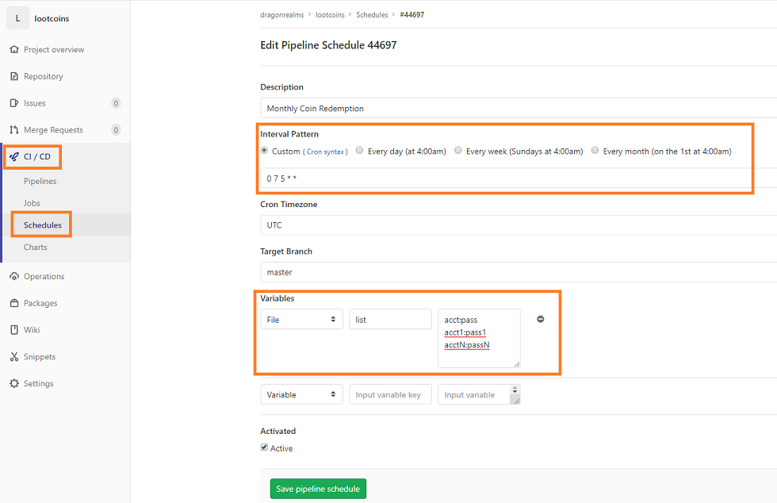

# lootcoins - Selenium Project to claim monthly reward
This project will ultimately be run as a docker image, in conjunction with `selenium/standalone-chrome` to create an automated, headless run.

## Configure this project automatically run
#### Schedule the job to run monthly
To schedule this job to run on a recurring schedule, navigate to CI / CD -> Schedules.  I use a custom cron that runs on the 5th of the month at 7am UTC, but this would work with the standard monthly option also.

To provide the username and password for the job to run, configure the variables section to mount a file (not variable) named "list" which contains a new-line seperated set of username:password key/value pairs.  See the image for example.


## Using the image to run locally
The image will expect 2 environment variables at runtime: user and pass.  This will be your play.net credentials.  The selenium script will claim your reward from store.play.net

First, there needs to be an instance of selenium available.  
```bash
docker run --name hub -p 4444:4444 -v /dev/shm:/dev/shm selenium/standalone-chrome
```
Once that is running, you can run lootcoins image
```bash
docker run --rm --link hub -e user=ACCOUNTNAME -e pass=PASSWORD registry.gitlab.com/dragonrealms/lootcoins
```

